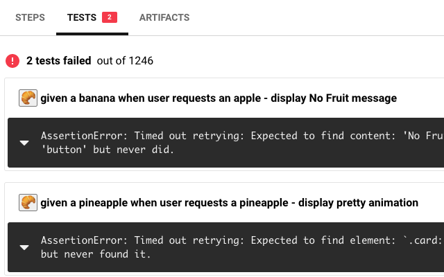

# webext-circleci-tweaks

Web extension for [Chrome](https://chrome.google.com/webstore/detail/circleci-tweaks/ckgcdofchjnpdocejdjmajhnpgnohklf?hl=en&authuser=1) and [Firefox](https://addons.mozilla.org/en-US/firefox/addon/circleci-tweaks/).

## Features

TODO

## Configuration

TODO

## Contributor's Guide

### Publishing

It's possible to automatically publish to both the Chrome Web Store and Mozilla Addons at once by adding these secrets on GitHub Actions:

1. `CLIENT_ID`, `CLIENT_SECRET`, and `REFRESH_TOKEN` from [Google APIs][link-cws-keys].
2. `WEB_EXT_API_KEY`, and `WEB_EXT_API_SECRET` from [AMO][link-amo-keys].

Also include `EXTENSION_ID` in the secrets ([how to find it](https://stackoverflow.com/a/8946415/288906)) and add Mozilla’s [`gecko.id`](https://developer.mozilla.org/en-US/docs/Mozilla/Add-ons/WebExtensions/manifest.json/browser_specific_settings) to `manifest.json`.

The GitHub Actions workflow will:

1. Build the extension
2. Create a version number based on the current UTC date time, like [`19.6.16`](https://github.com/fregante/daily-version-action) and sets it in the manifest.json
3. Deploy it to both stores

#### Auto-publishing

Thanks to the included [GitHub Action Workflows](.github/workflows), if you set up those secrets in the repo's Settings, the deployment will automatically happen:

- on a schedule, by default [every week](.github/workflows/deploy-automatic.yml) (but only if there are any new commits in the last tag)
- manually, by clicking ["Run workflow"](https://github.blog/changelog/2020-07-06-github-actions-manual-triggers-with-workflow_dispatch/) in the Actions tab.
